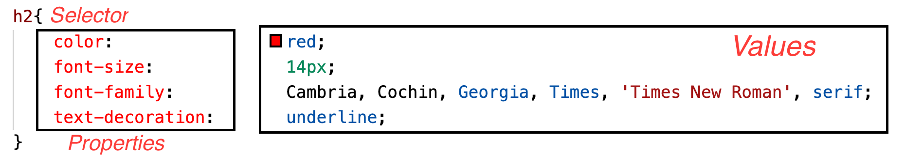

## What is CSS?
CSS (Cascading Style Sheets) is a style sheet language for creating great-looking web pages. It describes the presentation of elements in a document. You define a group of styles that are applied to partical elements on your web page. For example, you want the main heading to be shown as large red text.

### Inline CSS
- It is often used to apply a style for a single html element.
- To add inline CSS, you can simply add the style to the corresponding element.

> Example of Inline CSS

```html
<h1 style="color:brown;text-align:left;">This is my heading</h1> 
<p style="color:red;">This is a paragraph.</p>
``` 
### Embedded CSS
The embedded CSS or the internal CSS is written inside the ```<style>``` element in the ```<head>``` section of your HTML document.

> Example of embedded CSS

```html
      <!DOCTYPE html>
      <html>
      <head>
      <style>
      body {
        background-color:red;
      }
      h1 {
        color: blue;
      }
      </style>
      </head>
      <body>
      <h1>This is a heading</h1>
      <p>This is a paragraph.</p>
      </body>
      </html>
```
### External css
The best way of adding a CSS to your html document is by creating a css file with an extension .css.

**Linking the css**
To link style.css to index.html add one of the following line somewhere inside the <head> of the HTML document.

```html
<link rel="stylesheet" href="style.css">
<link href="css/style.css" rel="stylesheet" type="text/css">
<link rel="stylesheet" href="https://stackpath.bootstrapcdn.com/bootstrap/4.4.1/css/bootstrap.min.css">
```
### CSS: Selectors
CSS selector defines what elements should the CSS property be applied.



**CSS Example**
- [Example Page] (https://dipaish.github.io/www2020/cssexample.html)
- [CSS File](https://raw.githubusercontent.com/dipaish/www2020/master/docs/css/learncss.css) 

## CSS Validator
To validate your CSS style sheet, you can use the CSS Validation service at this link: [CSS Validation service](https://jigsaw.w3.org/css-validator/)

**To learn more:**
- https://www.google.fi/search?sourceid=navclient&ie=UTF-8&q=html%2Blearn
- https://www.w3schools.com/html/default.asp
- CSS Reference: https://cssreference.io/

## Exercise 3
It is now time to apply what you have learnt, please find the exercise at the link below: 
***[Exercise 3](https://docs.google.com/document/d/e/2PACX-1vRWhn2itEQ-aSwJz10PMxaqrqBffQUuqOIaAkJ4iZNE02vnx9TyfSppX3SudUw1XA/pub)***