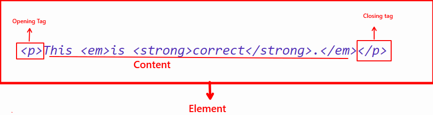
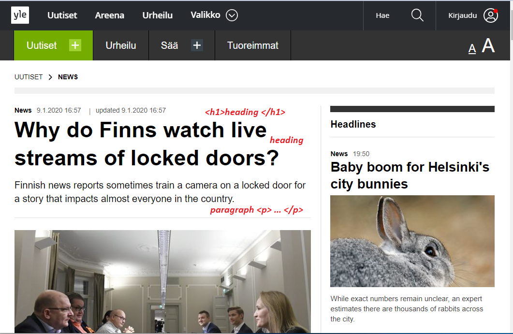
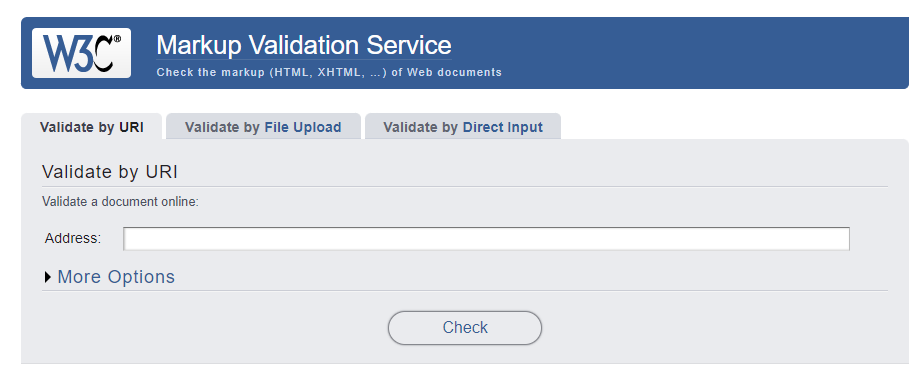
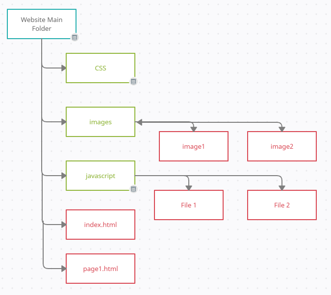
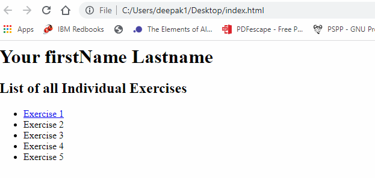

# Basics of HTML

## Tools for web development
You need atleast some of the following tools to get started with web development. Depending on your development activity (frontend, backed or full stack), you will need some of the following tools. You will need at the minumm code or text editor and a browser.

- **Code or Text editors:** Sublime Text, Notepad++, ***Visual Studio Code***
- **Front-End Frameworks:**  Bootstrap, Semantic-UI, Material UI
- **Web Application Frameworks:**  Django, Angular, ReactJS
- **Package Managers:**  NPM, Yarn, Material UI
- **Git Clients:**  Github, Github Desktop
- **Web Design & Prototyping Tools:**  Figma, Protooie, Framer
- **Image Editing:**  Adobe Photoshop, Gimp


## Frontend

The frontend of a web page is the graphical user interface to create elements and interact with the functionalities as seen by the end user. The frontend is used to ensure the visual aspect of a website is functional. **HTML** is the fundamental component of the web that defines the structure of a web page. ALong with HTML other technolgies such as **CSS and JavaScript** are used to implement the web page's apperances. The list of technolgies commonly used to develop the frontend of a web page are as below: 
- HTML
- CSS
- JavaScript
- Frontend frameworks such as Vue.js, React Framework, Angula Framework


## Backend

Backend development is the development that happens on the server side to ensure all functionalities on the client side (frontend) of the website are functional. The features implemented at the back end are utilized via the fronted and may include activities such as storing and updating data, creating APIs and libraries. The list of technolgies commonly used to develop the backend of a web page are as below: 

- PHP
- C++
- Java
- Python
- Node.js
- Backend frameworks such as Express, Django, Laravel, Spring etc. 

## What is HTML?
**Hypertext Markup Language (HTML)** is the standard markup language for documents that are designed to be displayed in a web browser. HTML is not a programming language. It is a markup language that tells browser how to structure a web page. HTML is made up of sereis of **elements** such as a piece of text, a pragraph, list, table, links or forms and is saved with an extension ```.HTML```. 

***Lets write the following line of text in a text file and save it as*** **file1.html** 

```html
I am learning to develop web pages
```

*** Now lets use the paragraph tag by modifying*** **file1.html**
```html
<p>I am learning to develop web pages.</p>
```

>> Note: Tags in HTML are case-insensitive. This means they can be written in uppercase or lowercase. However, it is strongly recommended to write all tags in lowercase for consistency, readability, and other reasons.

***A simple HTML document looks like this***
```html
    <!DOCTYPE html>
    <html lang="en">
     <head>
      <title>My page</title>
     </head>
     <body>
      <h1>My page</h1>
      <p>This is a <a href="link">simple</a> Link</p>
      <!-- this is a comment -->
     </body>
    </html>
```   

| Tag  | Description |
| -------------| ------------- |
| ``` <!DOCTYPE html> ```       | It is simply meant to act as links to a set of rules tht the HTML page had to follow. In current time, rarerly anyone cares about it however it is recommended to start with the DOCTYPE.  |
| ``` <html>  </html> ```        | This element simply wraps all the content on the entire page, and is sometimes known as the root element.  |
| ``` <head></head> ```          | This element acts as a container for all the stuff (keywords, page description,css, character set declarations and more) you want to include on the HTML page, that isn't the content you are showing to your page's viewers.|
| ``` <title></title> ```         | This element defines the title of your page, that appears in the browser tab and is used to describe the page when you bookmark/favorite it.  |
| ``` <body></body> ```      | This element contains all the content that is displayed to web users such as text, images, videos or games.  |


## HTML Elements
As in the above example, **html** document consists of a **tree** of elements and text. Each element starts with a **tag** and ends with a **tag.** Tags have to be **nested** such that they are completely within each other without **overlapping**.

```html
<p>This <em>is <strong>correct</strong>.</em></p>
<p>This is <em>very <strong>wrong</em>!</strong></p>
```

>> Note: Tags in HTML are case-insensitive, i.e. they can be written in uppercase or lowercase. Best practice, however, is to write all tags in lowercase for consistency, readability, and other reasons.

***There are two important categories of elements in HTML.***
- **Block Level Elements:**
Block-level elements form a visible block on a page. A block-level element appears on a new line following the content that precedes it. Any content that follows a block-level element also appears on a new line. Block-level elements are usually structural elements on the page. For example, a block-level element might represent headings, paragraphs, lists, navigation menus, or footers. A block-level element wouldn't be nested inside an inline element, but it might be nested inside another block-level element.
Example:
```html
      <p>paragraph 1</p><p>paragraph 2</p><p>paragraph 3</p><p>paragraph 4</p>
```

- **Inline Elements:**
These elements are contained within the block level elements that is it does not cause a new line to appear in the document.
Example:
```html   
      <em>element 1</em> <em>element 2</em> <em>element 3</em>
```

## Whitespaces in HTML
The whitespace includes space characters as well as line breaks. You can have lots of whitespaces in your code but the HTML parser reduces space(s) or line breaks into a single space when rendering the HTML code. There is no reason to use more white spaces as it might affect the readability if it is not nicely formatted.
```html 
<p> this is properly formatted in terms of whitespaces</p>
    <p>this is 
      very                    random and is not effective enough when 
      reading 
      the 
      code. 
    </p>
```

## Using Special Characters in HTML
```<, > , " and &``` are special characters which are parts of HTML syntax, Therfore, when you need to use them in your html code you need to use the character equivalent as in the table below, to not have it interpreted as code.

| HTML Character  | Equivalent Character Reference |
| ------------- | ------------- |
|``` < ```| ``` &lt; ``` |
| ``` > ```	| ``` &gt; ``` |
| ``` " ``` | ``` &quot; ```|
|``` ' ```	|``` &apos; ``` |
|``` & ```	| ``` &amp; ``` |

## Comments in HTML

It is a good idea to write comments whereever applicable. Comments are ignored by the browser and are invisible to the user.
***To type comment in HTML:***
```html 
 <!-- comment asdsad asdasda -->
 ```

## Formatting elements in HTML

- HTML is used to structure text within a page by adding headings, paragraphs, emphasizing words and more.

- The structured content provides a better and enjoyable reading experience.

- Headings are to be wrapped in a heading element ```<h1>```. There are 6 level of heading elements ```<h1>, <h2>, <h3>, <h4>,<h5> & <h6>```.

- Paragraphs are wrapped in a ```<p>```

```html 
<h1>My heading</h1>
<p>This is a paragraph.</p>
 ```
***Example of a Structure***


### Heading ###
- Heading is commonly used in web pages to define the hierarchy of a web page. 
- HTML offers 6 levels of heading ```<h1> <h2> <h3> <h4> <h5> <h6>```
Example:
```html
      <h1>This is level 1 heading.</h1>
      <h2>This is level 2 heading.</h2>
      <h3>This is level 3 heading.</h3>
      <h4>This is level 4 heading.</h4>
      <h5>This is level 5 heading.</h5>
      <h6>This is level 6 heading.</h6>
```
### Paragraphs ###
- Pargraph is another common element that is used to write paragraphs in HTML document. 
- It starts with the ```<p>``` tag and ends with ```</p>``` tag. 
Example: 
```html
      <p> This is a pargraph. </p>
      <p> This is another pargraph. </p>
```

### Lists: Unordered
```html 
<ul>
<li>Deepak</li>
<li>Markku</li>
<li>Pekka</li>
<li>Juha</li>
</ul>
```

### Lists: Ordered
```html 
<ol>
<li>Deepak</li>
<li>Markku</li>
<li>Pekka</li>
<li>Juha</li>
</ol>
```

### Lists: Nested
```html 
<ol>
<li>Chapter 1</li>
<li>Chapter 2</li>
<li>Chapter 3</li>
<li>Chapter 4
<ul>
<li>Chapter 4.1</li>
<li>Chapter 4.2</li>
</ul>
</li>
</ol>
``` 
### Emphasizing Certain Words

It is sometimes needed to emphasize certain words within your text. HTML provides several semantic elements to mark up textual content with different effects.

**Emphasis:** ``` <em>...</em> ``` This is <em> emphasized text.</em>

**Bold:** ``` <b>...</b> ``` This is <b>bold text.</b>

**Strong:** ``` <strong>...</strong> ``` This is <strong> strong text.</strong>

**Italic:** ``` <i>...</i> ``` This is <i>italicized text </i>.

**Underline:** ``` <u>...</u> ``` This is <u>underlined text.</u>

**Mark:** ``` <mark>...</mark> ``` This is <mark>marked text.</mark>

**Sub:** ``` <sub>...</sub> ``` This is <sub>subscript text.</sub>

**Sup:** ``` <sup>...</sup> ``` This is <sup>superscript text.</sup>

**Del:** ``` <del>...</del> ``` This is <del>deleted text.</del>

**Ins:** ``` <ins>...</ins> ``` This is <ins>inserted text.</ins>

### Images in HTML

The ```img``` element and its src attribute are used to embed an image in HTML.
```html 
 


```  
**Image Sizes**
You may use width and height attribute to size image however it is recommended to use photo editing software to determine the size of images to produce a better result. Resizing images properly will download faster when users view your pages.

***Image size can also be specified as a windows percentage.***

```html 

```

**Alternative Text**
The **alt** attribute is a textual description of the image that is displayed to the user when am image is not found or takes a long time to render due to slow internet connection. It is also handy for visually impaired user who is using a screen reader to read the web.

```html 

```

**Image Titles**
The ***title*** attribute in image provides a tooltip on mouse over.It is however not recommended due to various accessibility problems.

```html 
  
``` 
**Image Captions in HTML5**
You can use ```<figure> and <figurecatpion>``` elements.
```html 
    <figure>
      
    <figcaption>Image caption</figcaption>
    </figure>
```

**Image within a paragraph**
As per need, you may align your image either on the left or right side of your paragraph. 
- ***To align image on the left side of a paragraph***
```html 
  <p> Lorem ipsum dolor sit amet consectetur adipisicing elit. Magni quae eveniet sequi, ex provident obcaecati corporis et distinctio dolore voluptatum architecto, deserunt explicabo soluta harum veritatis quo adipisci expedita excepturi officiis nulla qui voluptatibus? Libero quis at iste ex aspernatur eaque saepe, 
        minus asperiores distinctio ratione repellat excepturi incidunt iusto?Lorem ipsum dolor sit amet consectetur adipisicing elit. Magni quae eveniet sequi, ex provident obcaecati corporis et distinctio dolore voluptatum architecto, deserunt explicabo soluta harum veritatis quo adipisci expedita excepturi officiis nulla qui voluptatibus? Libero quis at iste ex aspernatur eaque saepe, 
        minus asperiores distinctio ratione repellat excepturi incidunt iusto?</p>
``` 

***To align image on the right side of a paragraph*** 
```html 
  <p> Lorem ipsum dolor sit amet consectetur adipisicing elit. Magni quae eveniet sequi, ex provident obcaecati corporis et distinctio dolore voluptatum architecto, deserunt explicabo soluta harum veritatis quo adipisci expedita excepturi officiis nulla qui voluptatibus? Libero quis at iste ex aspernatur eaque saepe, 
        minus asperiores distinctio ratione repellat excepturi incidunt iusto?Lorem ipsum dolor sit amet consectetur adipisicing elit. Magni quae eveniet sequi, ex provident obcaecati corporis et distinctio dolore voluptatum architecto, deserunt explicabo soluta harum veritatis quo adipisci expedita excepturi officiis nulla qui voluptatibus? Libero quis at iste ex aspernatur eaque saepe, 
        minus asperiores distinctio ratione repellat excepturi incidunt iusto?</p>
``` 

***Understanding Image URLS & Important Notes***
- The **src** attribute in img tag locates the image file
- There are two types of URLs: **Absolute & Relative**
    - **Absolute:** The exact location of the image that normally begings with http://....
    - **Relative:** To better organize, images are stored within a specific folder. In such cases, you can use relative location such as images/image1.jpg
- Search engines also read image filenames and count them towards SEO. Therefore, it is wise to use a descriptive image filename; apple.jpg is better than img135.png.
- Make sure, you own copyrights before displaying an image in your webpage.
- Images garner attention and draw emotion therfore use images wisely as people pay more attention to image than text.
- Try to limit larger size images as much as possible so that they are not slowing down your website.

### Links

- You get to find a lot of links in a web page. 
- Links are used to navigate between different pages or sections of a web page.
- Links can point to HTML files, text documents, images, video or audio files, or other web pages. 
- You create a basic link by using ```<a>``` element with the ```href``` attribute.
- You can use the **target** attribute to specify how the link should be opened such as in the same tab or in a new tab. 

***Examples***
```
<!-- Linking to HAMK Page, opens in the same tab -->

<a href="https://www.hamk.fi/">HAMK</a>

<!--Image as a link, on clciking an image, it takes to the HAMK page. -- >
<a href="https://www.hamk.fi/">
  
</a>

<!-- _blank : opens the link in a new tab -->
<a href="https://www.hamk.fi/" target="_blank">HAMK</a>
 
```

## Debugging HTML 
It is very likely that you commit errors when coding. Some of your code won't work at all or works a bit differently than what you have expected. HTML is not as complicated as other programming languages like Python or Php.The way browsers parse html document is more permissive than other languages. For instance, missing a semicolon in some programming language will mess up thing whereas in html, even if you write the elements incorrectly its going to product certain output.

When something is wrong in code, there are mainly two types of errors ***Syntax errors & Logic Errors*** . 

  - **Syntax error** may cause the program not to run and can be easily fixed by as long as you are familiar with the language's syntax and know what the error messages mean.
  - **Logic Errors** is when the sytax is correct but the program is not running as intended. It is difficult to fix this kind of errors.

>> Note: HTML is parsed permissively because when the web was first created, it was decided that allowing people to get their content published was more important than making sure the syntax was absolutely correct. The web would probably not be as popular as it is today, if it had been more strict from the very beginning.

## HTML Validation
The HTML code below includes errors. As in  this case, since the html code is not very long, one can search through the lines and correct errors. **But how to check errors when the HTML document is complex and very long?**

- The best option is to use **Markup Validation Services** which is created and maintained by **W3C** (the organization that looks after the specifications that define HTML, CSS, and other web technologies.)
- The **HTML validator** will take your HTML document as an input, process it and provides you a report that tells what is wrong with your HTML.
- You have 3 options to validate your html document 
  - **Validate by URL**: use the link of your page that you want to validate. 
  - **Validate by File Upload**: Upload the html file that you want validate. 
  - **Validate by Direct Input**: Directly input the html code that you want to validate. 

[Markup Validation Service](https://validator.w3.org/) 



***Lets look into the following html code and try to validate the document by Direct Input***
- Step 1: Get to Validator Page: https://validator.w3.org/
- Step 2: Select Validate by Direct Input
- Step 3: Copy and paste the following HTML code in the input box.
- Step 4: Click Check. 
- Step 5: Check the results and fix warnings and errors. 

```html 
<!DOCTYPE html>
<html>
  <head>
    <meta charset="utf-8">

    <title>HTML debugging examples</title>

    <!--[if lt IE 9]>
      <script src="https://cdnjs.cloudflare.com/ajax/libs/html5shiv/3.7.3/html5shiv.js"></script>
    <![endif]-->
  </head>
  <body>
    <h1>HTML debugging examples</h1>

    <p>What causes errors in HTML?

    <ul>
      <li>Unclosed elements: If an element is <strong>not closed properly, then its effect can spread to areas you didn't intend

      <li>Badly nested elements: Nesting elements properly is also very important for code behaving correctly. <strong>strong <em>strong emphasised?</strong> what is this?</em>

      <li>Unclosed attributes: Another common source of HTML problems. Let's look at an example: <a href="https://www.mozilla.org/>link to Mozilla homepage</a>
    </ul>
  </body>
</html>
```
## Exercise 1: Text Formatting and page content
***Create a (root)folder anywhere in your PC/Cloud and name it as your firstname_lastname*** for your website(all individual exercises). Your website has different types of files: codes (html, css) and assets such as images.

- Create a proper folder structure
- Create an index.html

***Example of a website folder structure***



***The page should look as below:***


- Use heading1 for "your name"
- Use heading2 for "List of all Individual Exercises"
- Exercise1 in the list should **link** to the file exercise1.html [Creating hyperlinks](https://developer.mozilla.org/en-US/docs/Learn/HTML/Introduction_to_HTML/Creating_hyperlinks)
- Visit any website of your choice. Make an HTML page that has roughly the same content. You don't need to worry about formats, backgrounds or colors. The main objective is to use elements and tags correctly in HTML.You can ignore the menu bar,left or side bars. Follow the guidelines below:

    - Start writing your html code. Save the file as exercise1.html and do all following tasks in the same file
    - The HTML head is the contents of the ```<head>....</head>``` element. The content of the head element is not displayed to the user. It contains metadata about the document such as the author information, the title of the page, the metadata element such as the document's character encoding, custom icon to your page, link to the CSS and JavaScript file that are applied to the pages, primary language of the document, Your task is to include a proper title, the author information,set the character set as utf-8 and a brief description that is used on a search engine result pages.For this task, please consider reading this document: [What's in the head?](https://developer.mozilla.org/en-US/docs/Learn/HTML/Introduction_to_HTML/The_head_metadata_in_HTML)
    - The top level heading of the page can be heading 1
    - Put text pieces from the website in the  ```<p>``` tag
    - Add a link to the website that you have selected for this task.
    - Apply some text formatting such as bold, italic, underline to some part of your text.
    - Add a paragraph that has an image that is aligned to the right side of the page. 
    - Validate your html document by using [Markup Validation Service](https://validator.w3.org/) 
    - Fix errors and warnings if there are any. 

## Mulitmedia in Web pages

You have already embedded images in your web page. You can embed different types of multimedia such as a video and audio content, vector graphics and responsive images.

The ```<video>``` element allows you to embed a video.

```html
 <video src=""images/test.mp4" controls width="400" height="250">
    <p>Your browser doesn't support HTML5 video.
       Here is a <a href="assets/video/test.mp4">link to the video</a></p>
  </video>
```

<video src="assets/video/test.mp4" controls width="400" height="250">
    <p>Your browser doesn't support HTML5 video.
       Here is a <a href="assets/video/test.mp4">link to the video</a></p>
  </video>

The other options you can use are ```autoplay, loop, muted, preload="auto" ```.

***Example***

```html 
<video src="assets/video/test.mp4" controls width="400" height="250" autoplay loop muted>
  <p>Your browser doesn't support HTML5 video.
     Here is a <a href="assets/video/test.mp4">link to the video</a></p>
</video>  
```

***The ```<audio>``` element allows to add an audio to your webpage.***
```html
<audio controls>
    <source src="assets/audio/file.mp3" type="audio/mp3">
    <p>Your browser doesn't support HTML5 audio. </p>
  </audio>
```
<audio controls>
    <source src="assets/audio/file.mp3" type="audio/mp3">
    <p>Your browser doesn't support HTML5 audio. </p>
  </audio>

## Embedding Technologies

```<iframe>```

The iframe element allows embedding different contents such as a <b>Youtube video or a Google Map</b>. It is very easy to embed third-party content however you should embed only if it is really important. When embedding content, please make sure that:

- The content is secure enough to share
- Be aware of intellectual property issues.
- Obey the licence terms of the content if the content is licensed.

**Example: Embedding a youtube video into your web page**

1. First, go to YouTube and find a video you like. Below the video, you'll find a **Share button**. Click the share button to display the sharing options.

2. Select the Embed button and you'll be given some ```<iframe>``` code. Copy the code

3.Insert the copied code into your HTML document.

```<embed>```

It allows you to embed external content such as a video.

***Example***
```html 
<embed type="video/webm"
       src="/media/video.mp4"
       width="250"
       height="200" title="title of the video">
```

```<object>```

It allows you to represent an external resource that is treated as an image or as a resource that is handled by a plugin.
```html 
<object type="application/pdf"
    data="/examples/file.pdf"
    width="250"
    height="200">
</object>
```
## Some More elements for formatting text
- Description list
- Quotations:Blockquotes & Inline Quotations
- Abbreviations
- Superscript & Subscript
- Marking up computer code in HTML

***Description list***

You may use ```<dl>``` elemet to create a **description list**. With the description list, you can mark up set of items and their descriptions such as questions and answers or terms and definitions.

```html
  <dl>
    <dt>Description Title</dt>
    <dd>Here you can have your description text.</dd>
    <dt>Title 1</dt>
    <dd>Description text.</dd>
  </dl>
```
***Quotations: Blockquotes, Inline Quotations & Citations***

There are options in HTML to mark up quotations.

**Example of a blockquote**

```html
<blockquote>Hello World</blockquote>
```
<blockquote>Hello World</blockquote>

**Example of inline quotations**

For inline quotations, you can use the ```<q>``` element. It is intended for short quotations which does not require paragraph breaks.

```<q>One more quotation</q>```
<q>One more quotation</q>
**Example of Abbreviations**

In-order to wrap around an acronym, you can use the ```<abbr>``` element.

```html
    <p> <abbr title="Hämeen ammattikorkeakoulu">HAMK</abbr> is one of the best UAS in Finland.</p>
```
<p> <abbr title="Hämeen ammattikorkeakoulu">HAMK</abbr> is one of the best UAS in Finland.</p>

**Marking up computer code**

To mark up computer code in HTML you have multiple elements in html.

```html
    <pre><code>var para = document.querySelector('p');

      para.onclick = function() {
        alert('Owww, stop poking me!');
      }</code></pre>
      
      <p>You shouldn't use presentational elements like <code>&lt;font&gt;</code> and <code>&lt;center&gt;</code>.</p>
      
      <p>In the above JavaScript example, <var>para</var> represents a paragraph element.</p>
      
      <p>Select all the text with <kbd>Ctrl</kbd>/<kbd>Cmd</kbd> + <kbd>A</kbd>.</p>
      
      <pre>$ <kbd>ping mozilla.org</kbd>
      <samp>PING mozilla.org (63.245.215.20): 56 data bytes
      64 bytes from 63.245.215.20: icmp_seq=0 ttl=40 time=158.233 ms</samp></pre>
```
  

## Inspect Element

### Table

### Form

### IDS & Classes

## References: 
- Mdn Web Docs 

>> To learn more

