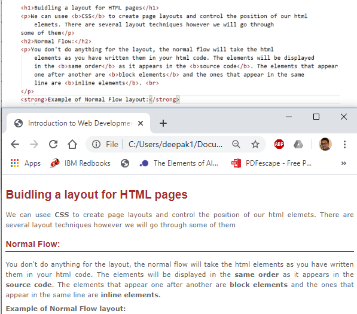

## Building a layout for HTML pages

We can use **CSS** to create page layouts and control the position of our html elements. There are several layout techniques however we will go through some of them

### Normal Flow

You don't do anything for the layout, the normal flow will take the html elements as you have written them in your html code. The elements will be displayed in the **same order** as it appears in the **source code.** The elements that appear one after another are block elements and the ones that appear in the same line are **inline elements.**

**Example of a Normal Flow Layout:**



### Flexbox (Flexible Box)

Flexbox (Flexible Box) is a versatile layout tool that allows you to effortlessly manage the arrangement of elements on your web pages.It makes things easier to put html elements either in a row or a column. Flexbox is one dimensional that is we can deal with the layout in one dimension at a time. We can use Flexbox to create flexible and responsive layout. 

***To use flex box:***

**Step 1: Create Flex Container**

We should first define a **flex container** or specify what **elements** are used as flexible boxes. A flex container is created by 
setting the `display` property to `flex` or `inline-flex`. The container is the parent element that holds the items whereas items are the child elements inside the container.

  ```html
  display: flex;  <!-- It creates a block-level flex container. The flex container takes up the full width of its parent container  -->
  <!-- or -->
  display: inline-flex;  <!-- It creates an inline-level flex container. The flex container only takes up as much width as necessary, allowing other elements to be on the same line.  -->
  ```
       
**Step 2: Add Flex Items** 

 Once a flex container is created, you can start to add items.  You can arrange these items both horizontally and vertically using various Flexbox properties.

#### Commonly used Flexbox properties 

**flex-direction** 

Flexbox is one dimensional. The property **flex-direction** specifies which direction the Flexbox children are in. By default it is set to row. 

The flex-direction values can be: ***row | row-reverse | column | column-reverse***

**Example:**
```html
flex-direction: column;
```

**flex-wrap:** 

The equal width and height of flex boxes can result in the child items overflowing their container which eventually breaks the layout. You can control whether flex items are forced onto one line or can wrap onto multiple lines. 

The flex-wrap values can be: ***nowrap | wrap | wrap-reverse***

**Example:** 
```html
flex-wrap: wrap;
```

**flex:**  

The flex property specifies the ability for a flex item to grow or shrink. It is actually a shorthand property that combines three individual properties: flex-grow, flex-shrink, and flex-basis. 

The flex values can be: ***0 (default value which means the flex item will not grow) or any positive integer that the item will grow proportionally to the other flex items based on the value assigned.***

**Examples** 
```html
<!-- It sets a specific initial size to 200 px for a flex item while allowing it to shrink if necessary. In simple sentence, the flex items will start with an initial size of 200 pixels, and if there's not enough space, they will shrink proportionally. -->
flex: 200px

<!-- All flex items have an equal share of any available space.-->
.flex-item {
    flex: 1;
}

<!-- The item will grow twice as much as other items.-->
.flex-item {
    flex: 2;
}

<!-- The item will not grow but can shrink if necessary.-->
.flex-item {
    flex: 0 1 auto;
}

```

**Example of a Flexbox layout:** [Link to the Example file](https://dipaish.github.io/www2020/flexbox.html)

**Let's work together and get the following layouts**
Get HTML code at this link: [Required File](https://dipaish.github.io/www2020/flex_box_in_class22.html)

- [Layout 1](https://dipaish.github.io/www2020/images/Lay1.PNG)
- [Layout 2](https://dipaish.github.io/www2020/images/layout2.PNG)


### Floats

The float property was introduced to allow web developers to implement simple layouts involving an image floating inside a column of text, with the text wrapping around the left or right of it. The kind of thing you might get in a newspaper layout. Floats are commonly used to create entire website layouts.

**Example of a Float layout:**

[Link to the Example file ](https://dipaish.github.io/www2020/floatexample.html)

### CSS Grid

A CSS grid is defined using the grid value of the display property; you can define columns and rows on your grid using the grid-template-rows and grid-template-columns properties.

**Some resources for learning CSS grid:**
- https://developer.mozilla.org/en-US/docs/Glossary/Grid
- https://css-tricks.com/snippets/css/complete-guide-grid

## Exercise 5: HTML Layout with Flex

It is now time to apply what you have learnt, please find the exercise at the link below: 
***[Exercise 5](https://gist.github.com/dipaish/40c3aca884119cc3bd0a05f76a27343a)***

***References***
[MDN Web Docs](https://developer.mozilla.org/en-US/docs/Learn/HTML/Introduction_to_HTML)

***To learn more***
- https://developer.mozilla.org/en-US/docs/Learn/CSS/CSS_layout/Flexbox
- https://www.w3schools.com/css/css3_flexbox.asp
- https://css-tricks.com/snippets/css/a-guide-to-flexbox/
- https://www.google.fi/search?sourceid=navclient&ie=UTF-8&q=html%2Blearn